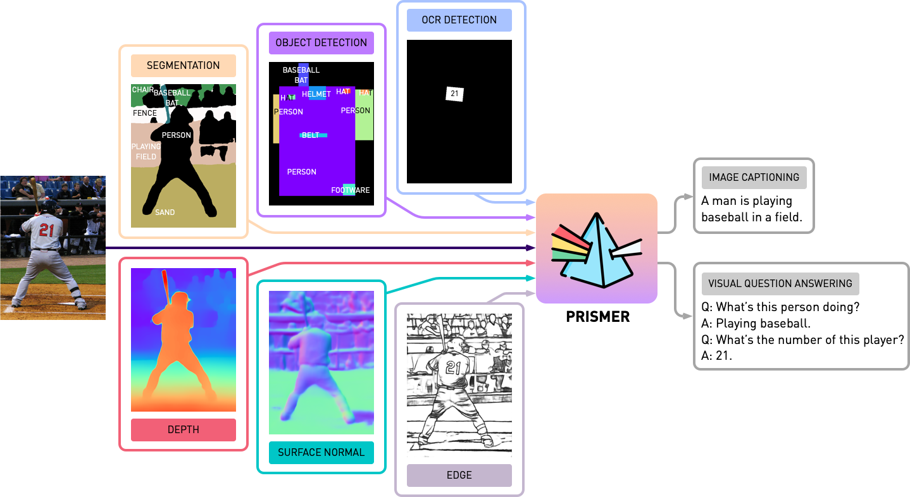

# Prismer
[](https://arxiv.org/abs/2303.02506)
 [](https://huggingface.co/spaces/shikunl/prismer)


This repository contains the source code of **Prismer** and **PrismerZ** from the paper, [Prismer: A Vision-Language Model with An Ensemble of Experts](https://shikun.io/projects/prismer). Check out our official demo at [HuggingFace Space](https://huggingface.co/spaces/lorenmt/prismer) and a third-party demo at [Replicate](https://replicate.com/cjwbw/prismer).



### Update Log
- **Apr. 3, 2023**: Improve HF Space demo with half precision inference and md5sum image check.
- **Mar. 22, 2023**: Fix tensor mismatch problem for the updated `transformers` package.
- **Mar. 13, 2023**: Add official HF Space demo. 

## Get Started
The implementation is based on `PyTorch 1.13`, and highly integrated with Huggingface [`accelerate`](https://github.com/huggingface/accelerate) toolkit for readable and optimised multi-node multi-gpu training.

First, let's install all package dependencies by running
```bash
pip install -r requirements.txt
```

### Prepare Accelerator Config
Then we generate the corresponding `accelerate`  config based on your training server configuration. For both single-node multi-gpu and multi-node multi-gpu training, simply run and follow the instructions with,
```bash
accelerate config
```

## Datasets

### Pre-training
We pre-train Prismer/PrismerZ with a combination of five widely used image-alt/text datasets, with pre-organised data lists provided below.
- [COCO 2014](https://www.dropbox.com/s/6btr8hz5n1e1q4d/coco_karpathy_train.json?dl=0): the Karpathy training split (which will also be used for fine-tuning).
- [Visual Genome](https://www.dropbox.com/s/kailbaay0sqraxc/vg_caption.json?dl=0): the official Visual Genome captioning dataset.
- [CC3M + SGU](https://www.dropbox.com/s/xp2nuhc88f1czxm/filtered_cc3m_sbu.json?dl=0): filtered and re-captioned by BLIP-Large.
- [CC12M](https://www.dropbox.com/s/th358bb6wqkpwbz/filtered_cc12m.json?dl=0): filtered and re-captioned by BLIP-Large.

The web datasets (CC3M, SGU, CC12M) is composed with image urls. It is highly recommended to use [img2dataset](https://github.com/rom1504/img2dataset), a highly optimised toolkit for large-scale web scraping to download these images. An example bash script of using `img2dataset` to download `cc12m` dataset is provided below.
```bash
img2dataset --url_list filtered_cc12m.json --input_format "json" --url_col "url" --caption_col "caption" --output_folder cc12m --processes_count 16 --thread_count 64 --image_size 256
```

*Note: It is expected that the number of downloaded images is less than the number of images in the json file, because some urls might not be valid or require long loading time.*

### Image Captioning / VQA
We evaluate image captioning performance on two datasets, COCO 2014 and NoCaps; and VQA performance on VQAv2 dataset. In VQA tasks, we additionally augment the training data with Visual Genome QA, following BLIP. Again, we have prepared and organised the training and evaluation data lists provided below.

- [Image Captioning](https://www.dropbox.com/sh/quu6v5hzdetjcdz/AACze0_h6BO8LJmSsEq4MM8-a?dl=0): including COCO (Karpathy Split) and NoCaps.
- [VQAv2](https://www.dropbox.com/sh/hqtxl1k8gkbhhoi/AACiax5qi7no3pJgO1E57Xefa?dl=0): including VQAv2 and VG QA.

## Generating Expert Labels
Before starting any experiments with Prismer, we need to first pre-generate the modality expert labels, so we may construct a multi-label dataset. In `experts` folder, we have included all 6 experts we introduced in our paper. We have organised each expert's codebase with a shared and simple API.

*Note: Specifically for segmentation experts, please first install deformable convolution operations by `cd experts/segmentation/mask2former/modeling/pixel_decoder/ops` and run `sh make.sh`.*

To download pre-trained modality experts, run
```bash
python download_checkpoints.py --download_experts=True
```

To generate the expert labels, simply edit the `configs/experts.yaml` with the corresponding data paths, and run
```bash
export PYTHONPATH=.
accelerate experts/generate_{EXPERT_NAME}.py
```
*Note: Expert label generation is only required for Prismer models, not for PrismerZ models.*

## Experiments
We have provided both Prismer and PrismerZ for pre-trained checkpoints (for zero-shot image captioning), as well as fined-tuned checkpoints on VQAv2 and COCO datasets. With these checkpoints, it should be expected to reproduce the exact performance listed below.

| Model          | Pre-trained [Zero-shot] | COCO [Fine-tuned]   | VQAv2 [Fine-tuned] |
|----------------|-------------------------|---------------------|-------------------|
| PrismerZ-BASE  | COCO CIDEr [109.6]      | COCO CIDEr [133.7]	 | test-dev [76.58]  |
| Prismer-BASE   | COCO CIDEr [122.6]      | COCO CIDEr [135.1]	 | test-dev [76.84]  |
| PrismerZ-LARGE | COCO CIDEr [124.8]      | COCO CIDEr [135.7]	 | test-dev [77.49]  |
| Prismer-LARGE  | COCO CIDEr [129.7]      | COCO CIDEr [136.5]	 | test-dev [78.42]  |

To download pre-trained/fined-tuned checkpoints, run
```bash
# to download all model checkpoints (12 models in total)
python download_checkpoints.py --download_models=True

# to download specific checkpoints (Prismer-Base for fine-tuned VQA) in this example
python download_checkpoints.py --download_models="vqa_prismer_base"
```


*Note: Remember to install java via `sudo apt-get install default-jre` which is required to run the official COCO caption evaluation scripts.*


### Evaluation
To evaluate the model checkpoints, please run
```bash
# zero-shot image captioning (remember to remove caption prefix in the config files)
accelerate train_caption.py --exp_name {MODEL_NAME} --evaluate

# fine-tuned image captioning
accelerate train_caption.py --exp_name {MODEL_NAME} --from_checkpoint --evaluate

# fine-tuned VQA
accelerate train_vqa.py --exp_name {MODEL_NAME} --from_checkpoint --evaluate
```

### Training / Fine-tuning
To pre-train or fine-tune any model with or without checkpoints, please run
```bash
# to train/fine-tuning from scratch
accelerate train_{TASK}.py --exp_name {MODEL_NAME}

# to train/fine-tuning from the latest checkpoints (saved every epoch)
accelerate train_{TASK}.py --exp_name {MODEL_NAME} --from_checkpoint 
```

We have also included model sharding in the current training script via PyTorch's official [FSDP plugin](https://pytorch.org/tutorials/intermediate/FSDP_tutorial.html). With the same training commands, additionally add `--shard_grad_op` for ZeRO-2 Sharding (Gradients + Optimiser States), or `--full_shard` for ZeRO-3 Sharding (ZeRO-2 + Network Parameters). 

*Note: You should expect the error range for VQAv2 Acc. to be less than 0.1; for COCO/NoCAPs CIDEr score to be less than 1.0.*

## A Minimal Example
Finally, we have offered a minimal example to perform image captioning in a single GPU with our fine-tuned Prismer/PrismerZ checkpoint. Simply put your images under `helpers/images` (support `.jpg`, `.jpeg`, and `.png` images), and run
```bash
python demo.py --exp_name {MODEL_NAME}
```

You then can see all generated modality expert labels in the `helpers/labels` folder and the generated captions in the `helpers/images` folder.

Particularly for the Prismer models, we have also offered a simple script to prettify the generated expert labels. To prettify and visualise the expert labels as well as its predicted captions, run
```bash
python demo_vis.py
```

*Note: Remember to set up the corresponding config in the `configs/caption.yaml` demo section. The default demo model config is for Prismer-Base.*

## Citation

If you found this code/work to be useful in your own research, please considering citing the following:


```bibtex
@article{liu2023prismer,
    title={Prismer: A Vision-Language Model with An Ensemble of Experts},
    author={Liu, Shikun and Fan, Linxi and Johns, Edward and Yu, Zhiding and Xiao, Chaowei and Anandkumar, Anima},
    journal={arXiv preprint arXiv:2303.02506},
    year={2023}
}
```

## License
Copyright © 2023, NVIDIA Corporation. All rights reserved.

This work is made available under the Nvidia Source Code License-NC. 

The model checkpoints are shared under CC-BY-NC-SA-4.0. If you remix, transform, or build upon the material, you must distribute your contributions under the same license as the original.

For business inquiries, please visit our website and submit the form: [NVIDIA Research Licensing](https://www.nvidia.com/en-us/research/inquiries/).

## Acknowledgement
We would like to thank all the researchers who open source their works to make this project possible. [@bjoernpl](https://github.com/bjoernpl) for contributing an automated checkpoint download script.

## Contact
If you have any questions, please contact `sk.lorenmt@gmail.com`.